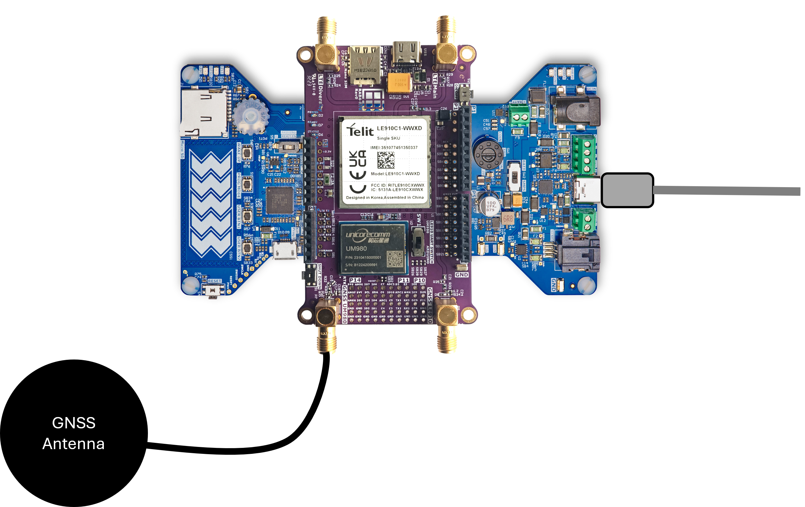

# RDK2 - Base station using RDK2 and RAB4-RTK

This example demonstrates how to use the UM980 sensor as a base station. The UM980 generates correction data in RTCM format. Those correction data are collected by the PSoC62 placed on the RDK2 and sent over the USB to a computer.

## Requirements

- [ModusToolbox® software](https://www.infineon.com/cms/en/design-support/tools/sdk/modustoolbox-software/) **v3.x** [built with **v3.1**]
- [RAB4-RTK](https://www.rutronik24.com/product/rutronik/rab4rtk/21856667.html)
- [RDK2](https://www.rutronik24.fr/produit/rutronik/rdk2/16440182.html)

## Using the code example with a ModusToolbox™ IDE:

The example can be directly imported inside Modus Toolbox by doing:
1) File -> New -> Modus Toolbox Application
2) PSoC 6 BSPs -> RDK2
3) Sensing -> RDK2 RAB4 RTK UM980 RTCM Base Station

A new project will be created inside your workspace.

To program the software on the PSoC62, use the KitProg3 USB connector.

## Operation

Simply plug a USB-cable into the USB connector of the RDK2 and connect it to your computer. The LEDs will start to flash. Meaning of the LEDs:

LED1 | LED2 | System status 
--- | --- | ---
OFF | OFF | Error state. Something wrong happened. Use the KitProg3 USB connector and a serial terminal to read the error messages.
--- | --- | ---
x | Blinking | Software is running
Blinking | x | RTCM correction data are being generated by the UM980

## Legal Disclaimer

The evaluation board including the software is for testing purposes only and, because it has limited functions and limited resilience, is not suitable for permanent use under real conditions. If the evaluation board is nevertheless used under real conditions, this is done at one’s responsibility; any liability of Rutronik is insofar excluded. 

